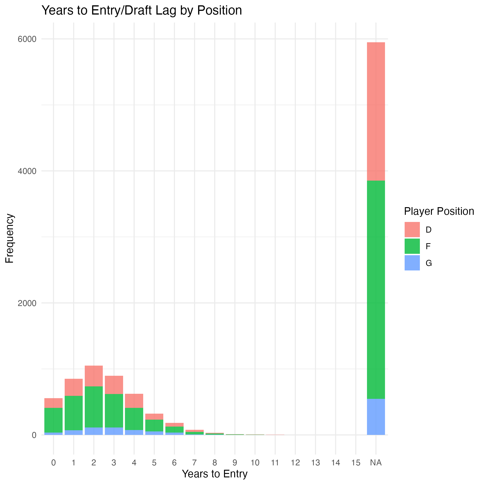
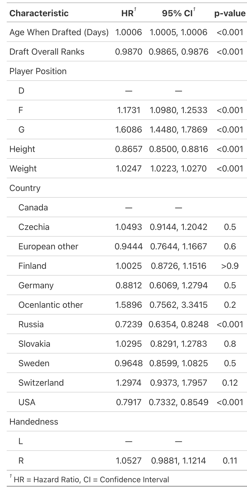
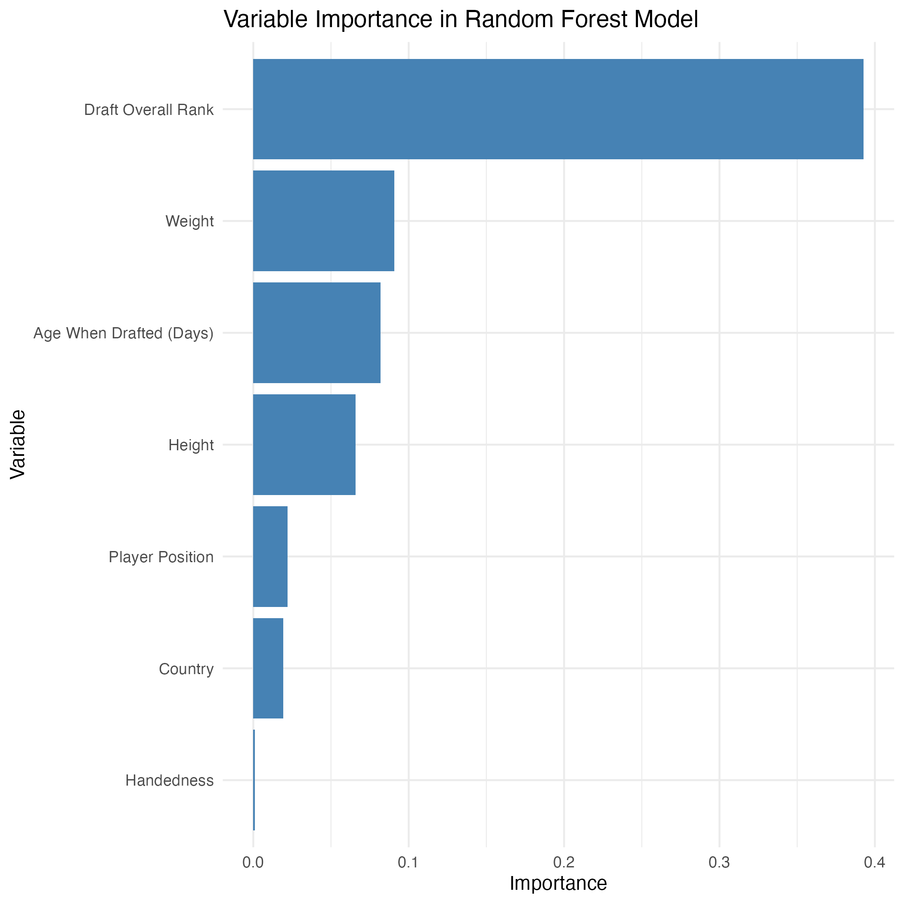

# 44 Year Variations in NHL Draft Lag by Country, Position, Draft Rank and Handedness

Yiru Wang1, Ben Csiernik2, Kathryn Johnston1 & Joseph Baker1

1Tanenbaum Institute for Science in Sport, University of Toronto;  2Ontario Tech University

**Target Audiences:** academia, coaches, athletes, industry

## Introduction

With professional ice hockey organizations relying on entry drafts for talent acquisition, understanding how athletes reach the National Hockey League (NHL) is crucial. 

## Methods 

This study explored the factors influencing and predicting draft lag, the time it takes for a drafted hockey player to enter the NHL (i.e., playing at least one game), while considering the influence of within-year relative age effects on the time to entry. The dataset comprised 10,530 observations between the 1980 draft and the 2023/24 season, each representing a player’s birthdate, draft date, draft overall ranking, position, height, weight, nationality, previous team, and handedness. Model performance was evaluated using the concordance index for a Cox model, and the continuous rank probability score (CRPS) were assessed using a Random Forest model. 

## Results:

*Figure 1*

*Table 1*

Descriptive results are shown in the Figure 1. The Cox model revealed all predictors except handedness were statistically significant. The model had a concordance index of 0.776, indicating a strong ability to distinguish between players who will enter the NHL sooners versus later based on the predictors. Players who were drafted earlier and were shorter tended to enter the NHL sooner. Conversely, older players at the time of the draft, forwards, goalies, heavier players, and those from the USA or Russia (compared to Canada) tended to enter the NHL later (more details see in Table 1 ). The Random Forest model corroborated these findings, highlighting draft overall ranking and weight as the most important predictors (see Figure 2). The CRPS was 0.163, indicating the model’s reasonable predictive accuracy.

*Figure 2*

## Discussion:

Overall, our study highlights the importance of considering a range of factors, including physical attributes and draft rankings, when predicting NHL entry. By recognizing these influences, hockey organizations can improve their drafting strategies and development programs, ultimately enhancing player progression to the NHL.

